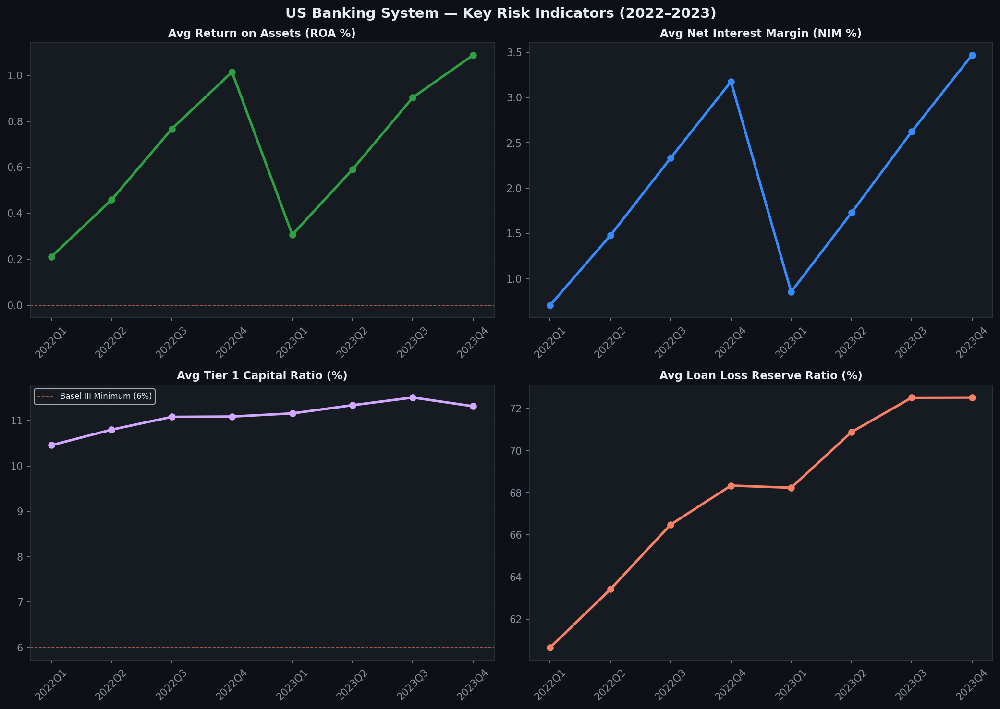
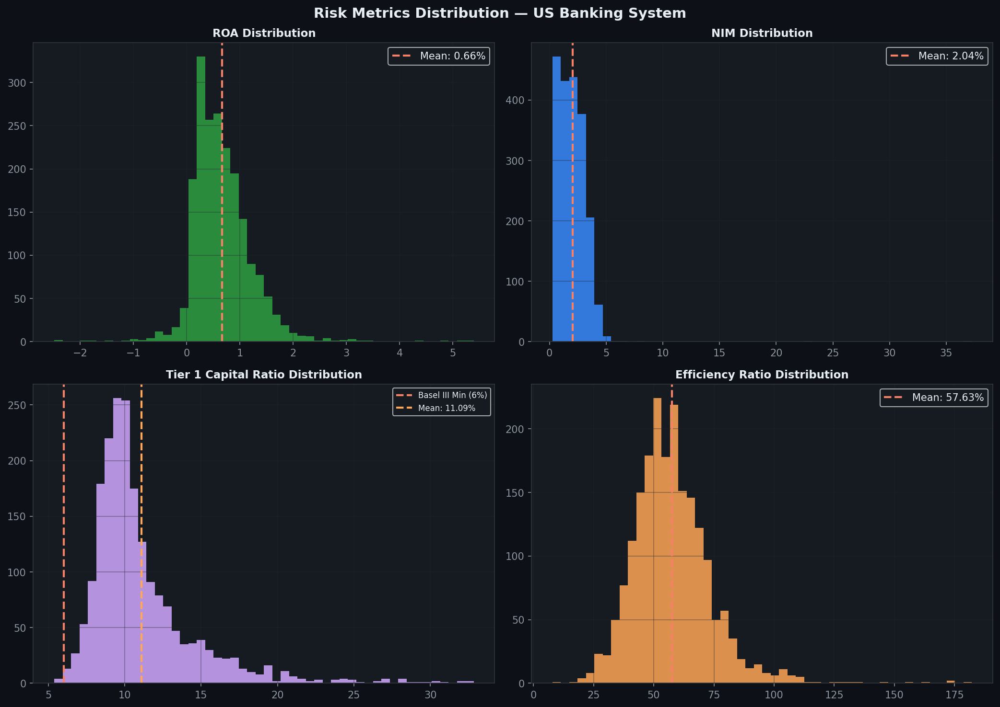
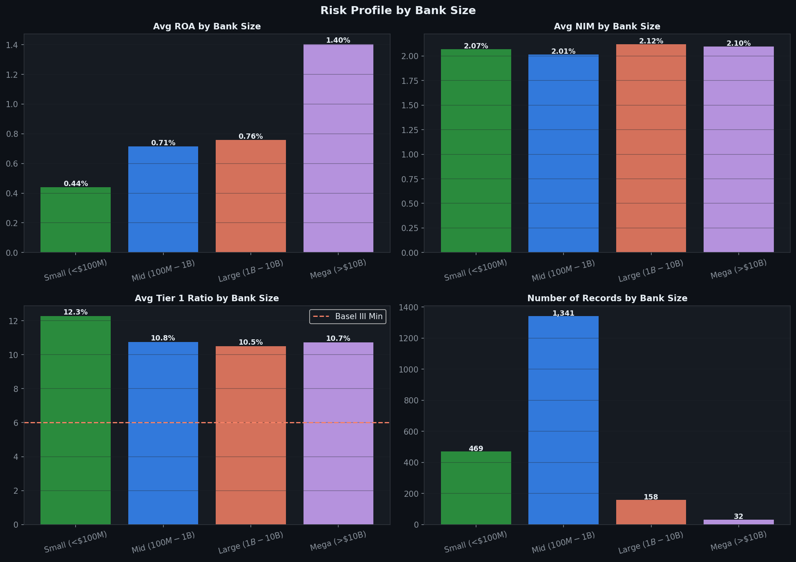
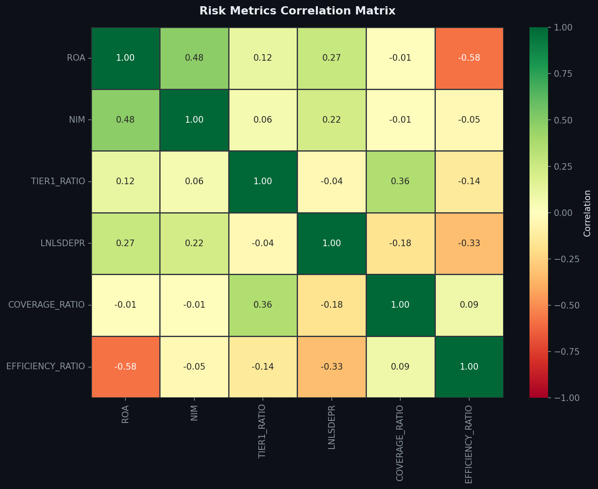
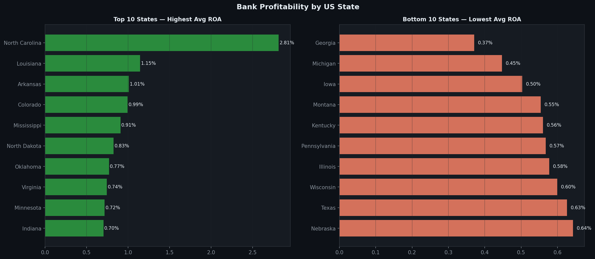
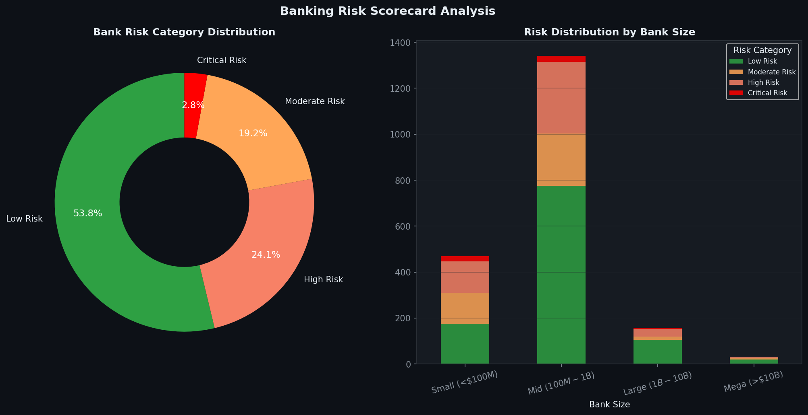

# US Banking Risk & Liquidity Analysis 🏦

## Overview
Comprehensive credit risk and liquidity analysis of **255 US banks** 
using real regulatory data from the **FDIC (Federal Deposit Insurance 
Corporation)**. This project applies the same analytical frameworks used 
by financial regulators to assess bank health, capital adequacy and 
risk exposure across 26 US states (2022–2023).

## Business Questions Answered
1. How healthy is the US banking system on key risk indicators?
2. Which banks and states show the highest credit risk?
3. How does bank size affect profitability and risk profile?
4. What percentage of banks are at critical risk of failure?
5. How do ROA, NIM and Tier 1 Capital correlate with each other?

## Dataset
- **Source:** FDIC API (banks.data.fdic.gov) — official US regulatory data
- **Size:** 2,000 records | 255 unique banks | 26 states | 2022–2023
- **Key Metrics:** ROA, NIM, Tier 1 Capital Ratio, Loan Loss Reserves,
  Efficiency Ratio, Coverage Ratio

## Regulatory Framework Applied
This analysis applies **Basel III** standards for capital adequacy:
- **Tier 1 Capital Ratio minimum:** 6% (well-capitalized: >8%)
- **ROA benchmark:** >1% (healthy), 0-1% (adequate), <0% (distressed)
- **NIM benchmark:** 2-4% (typical US bank range)
- **Efficiency Ratio:** <60% (efficient), >80% (inefficient)

## Tools Used
- **Python:** pandas, matplotlib, seaborn, numpy
- **Data Source:** FDIC REST API (real-time regulatory data)
- **Analysis:** Risk scoring, distribution analysis, state comparison
- **Version Control:** Git & GitHub

## Project Structure
├── credit_risk_analysis.py
├── fdic_complete.csv
└── README.md

---

## Key Metrics

| Metric | Value | Benchmark |
|--------|-------|-----------|
| Banks Analyzed | **255** | — |
| States Covered | **26** | — |
| Avg ROA | **0.66%** | >1% healthy |
| Avg NIM | **2.04%** | 2-4% typical |
| Avg Tier 1 Ratio | **11.09%** | >6% required |
| Low Risk Banks | **53.75%** | — |
| Critical Risk Banks | **2.85%** | — |

---

## Visualizations

### 📈 Key Risk Indicators Over Time

### 📊 Risk Metrics Distribution

### 🏦 Risk Profile by Bank Size

### 🔗 Risk Metrics Correlation Matrix

### 🗺️ Bank Profitability by US State

### 🎯 Banking Risk Scorecard

---

## Key Findings

### 💰 Profitability
- Average ROA of **0.66%** — below the 1% healthy benchmark
- Average NIM of **2.04%** — within normal range but compressed
- NIM improved through 2022-2023 as Fed rate hikes increased 
  interest income for banks

### 🏦 Capital Adequacy
- Average Tier 1 Ratio of **11.09%** — nearly double the Basel III 
  minimum of 6% — US banking system is well capitalized overall
- **Zero banks** fall below the 6% minimum requirement in this sample
- Smaller banks tend to hold higher capital ratios as a buffer

### 📊 Bank Size vs Risk
- **Mega banks (>$10B)** show lower ROA but more stable NIM
- **Small banks (<$100M)** have higher NIM but more volatile ROA
- **Mid-size banks ($100M-$1B)** show the best risk-adjusted profile
- Larger banks benefit from diversification but face margin compression

### 🎯 Risk Scorecard
- **53.75% Low Risk** — majority of US banks are financially healthy
- **2.85% Critical Risk** — 57 bank records show multiple stress indicators
- Critical risk banks are concentrated in specific states and 
  smaller asset categories
- High efficiency ratios (>80%) are the most common risk factor

### 🗺️ Geographic Insights
- Significant variation in bank profitability across states
- Some states show consistently negative average ROA — 
  indicating regional economic stress
- States with strong real estate markets tend to show 
  higher NIM due to mortgage lending activity

### 🔗 Key Correlations
- **ROA and NIM are positively correlated** — higher interest 
  margins drive profitability
- **Efficiency Ratio negatively correlates with ROA** — 
  more efficient banks are more profitable
- **Tier 1 Ratio shows weak correlation with ROA** — 
  capital adequacy alone doesn't guarantee profitability

---

## Business Recommendations

1. **Monitor Critical Risk banks closely** — 57 records show 
   multiple stress indicators requiring supervisory attention
2. **NIM compression is the key threat** — as Fed rates normalize, 
   banks must find alternative revenue sources
3. **Efficiency improvement is the highest-ROI lever** — 
   banks with efficiency ratio below 60% consistently outperform
4. **Mid-size banks are the sweet spot** — best risk-adjusted 
   returns with manageable operational complexity
5. **Geographic diversification matters** — state-level ROA 
   variation suggests regional economic exposure is a key risk factor

---

## Personal Connection
This analysis applies the same regulatory frameworks I worked with 
during my internship at **Superintendencia Financiera de Colombia**, 
where I monitored liquidity indicators and solvency metrics for 50+ 
supervised financial institutions under Basel III standards.

---

## Related Projects
- [Brazilian E-Commerce SQL Analysis](https://github.com/segobooking-finanz/brazilian-ecommerce-analysis)
- [RFM Customer Segmentation](https://github.com/segobooking-finanz/rfm-customer-segmentation)
- [Stock Market Financial Analysis](https://github.com/segobooking-finanz/stock-market-financial-analysis)
- [E-Commerce Power BI Dashboard](https://github.com/segobooking-finanz/ecommerce-powerbi-dashboard)
- [SaaS Sales Financial Analysis](https://github.com/segobooking-finanz/saas-sales-financial-analysis)

---

## Author
**Simón Segovia** | Financial & Data Analyst  
📧 simon.segoviavalen@gmail.com  
💼 [LinkedIn](https://www.linkedin.com/in/simón-sebastián-segovia-valenzuela-6505b1259)  
🐙 [GitHub](https://github.com/segobooking-finanz)
